Getting Started with Google Cloud
===
Training machine learning models can require heavy computational resources such as GPUs with several GB of memory.
Since such equipment is expensive, many machine learning researchers instead opt to train their models using virtual machines that run on Google Cloud or Amazon Web Services servers.
In this tutorial, we will cover how to set up and use a virtual instance on Google Cloud.


Obtaining Credits
---
To begin, fill out the [coupon retrieval form](https://google.secure.force.com/GCPEDU/?cid=ZfbUNZ6MxDq8k2m4BEJ3YjVpf9onYMn0yeulNOKpswq37kM0PVqjoUW1X58zr6O%2B/) with your UCI email address to obtain your Google Cloud credits.
You should recieve an email from Google with the coupon code and instructions on how to redeem it within a few days.


Create a Project
---
Now, let's create a project.
Begin by accessing the [Google Cloud Console](https://console.cloud.google.com).
You can change your active project by clicking the projects dropdown in the top navbar:

Create a new project by clicking the **+** button in the top-right corner of the project selection screen.
You will be prompted to give the project a name.
For this tutorial, we are using *GoogleCloudTutorial*:
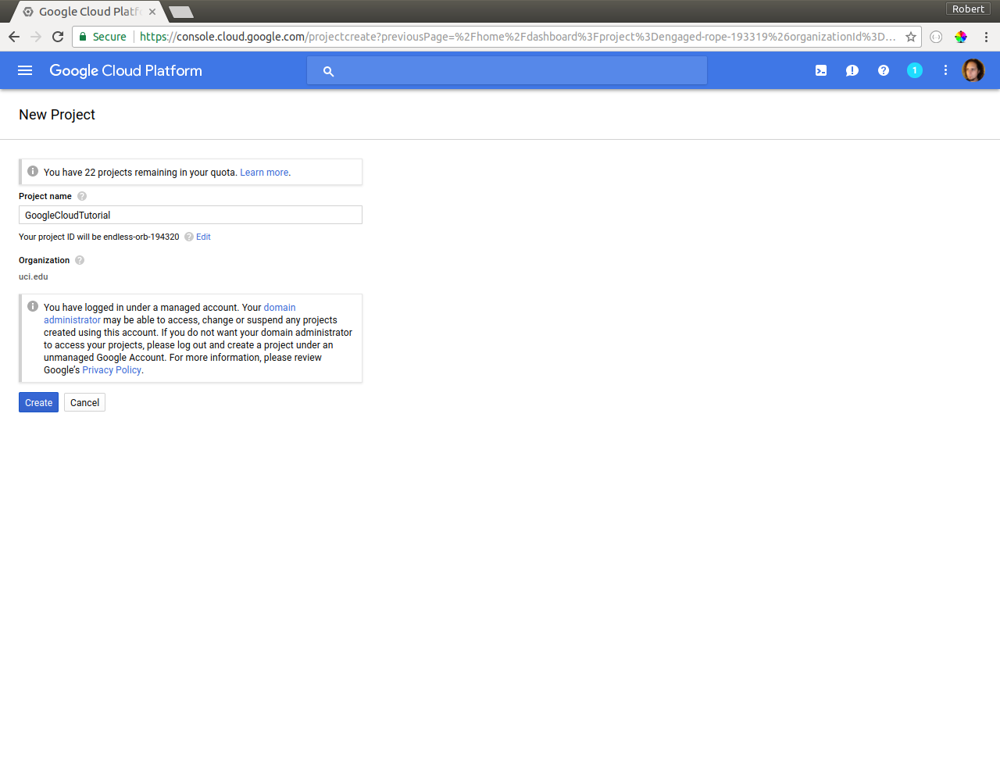
Once the creation process has finished, select this as your active project.
You can verify this by checking that your project name now appears at the top of the console.
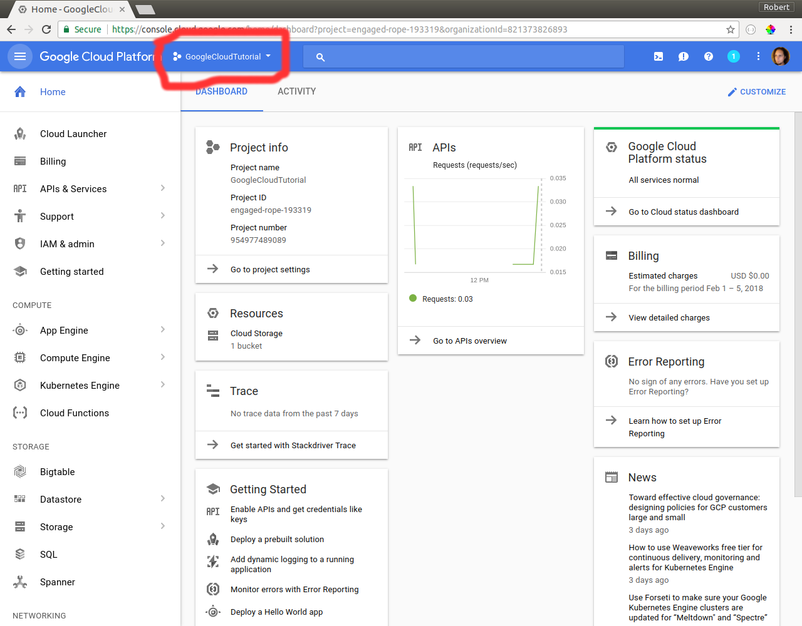


Link Your Project to Your Billing Account
---
We now should double-check that this project is linked to the billing account that has our Google Cloud credits.
To do this, click **Billing** on the left-navigation menu and select the billing account has your credits.
You should see your project listed under "Projects linked to this billing account" like so:
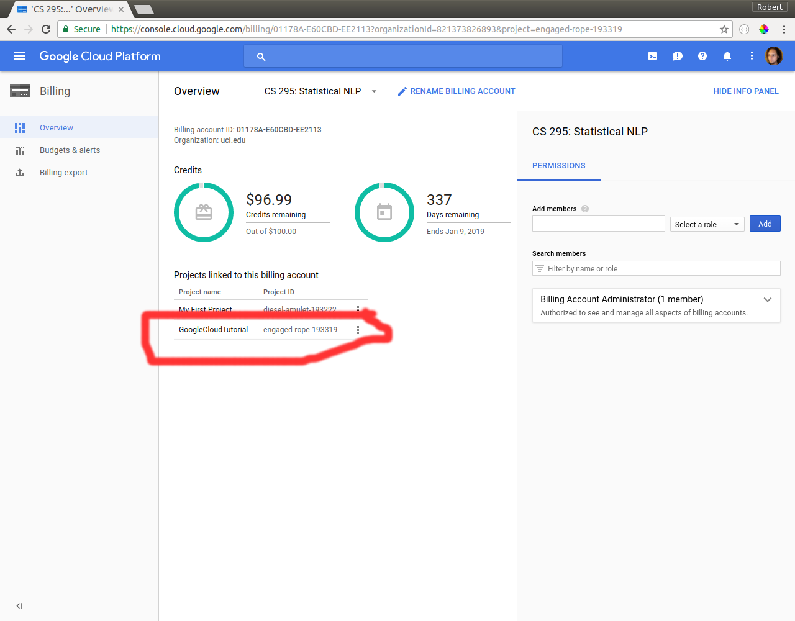


Increase Your GPU Quota
---
By default, Google Cloud prohibits setting up virtual instances with GPUs.
In order to use a GPU you will need to increase your quota.
To do this, click **Compute Engine** on the left navigation menu and then select **Quotas**:
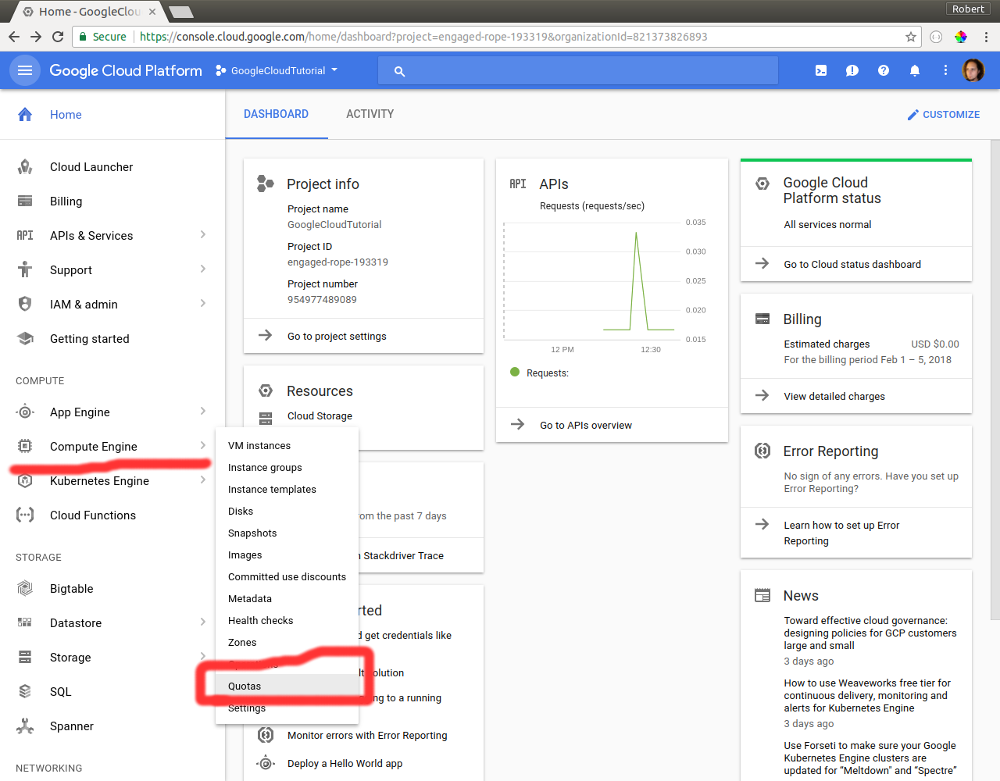
Then follow the link to your **IAM & Admin Quotas page**.
Open the **Metric** dropdown, and select **NVIDIA K80 GPUs**:
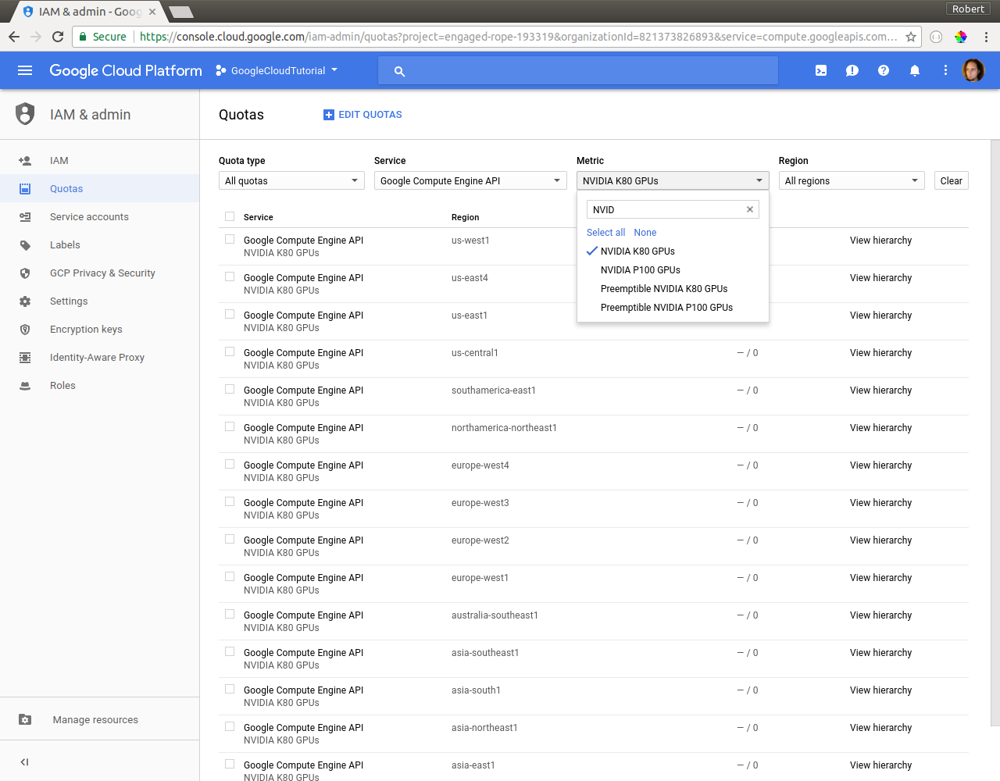
Select the quota for the *us-west1* region, and then press **Edit Quotas**.
Fill out your personal information:
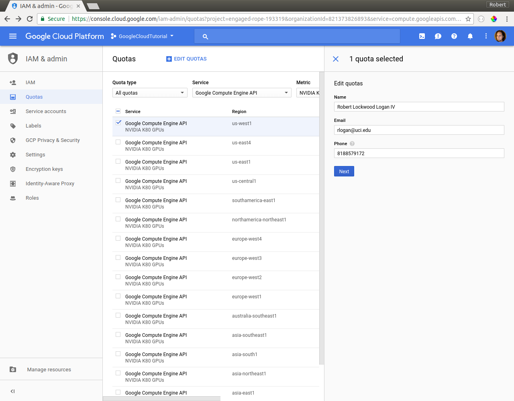
And set your **new quota limit** to 1:
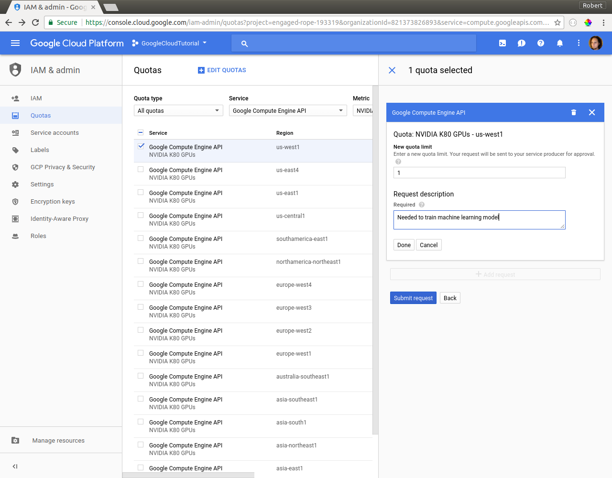
It may take a day or two for Google to approve your request.


Creating a Virtual Machine Instance
===


Load the Preconfigured Image
---
Typically when you create a virtual machine you will need to install the OS / Drivers / Libraries you need from scratch.
However properly setting up NVIDIA drivers, installing CUDA, etc. can be a time-consuming and confusing process.
To avoid these difficulties, we have provided an image of a fully setup system for you to use.
The image has the following software:

- **OS**: Ubuntu 16.06
- **CUDA Version**: 9.0
- **Python Versions**: 2.7 and 3.5
- **Python Libraries**:
    - NumPy
    - SciPy
    - Jupyter
    - Matplotlib
    - PyTorch
    - TensorFlow
    - Keras
    - NLTK

To use this image, click **Compute Engine** on the left navigation menu and select **Images**:
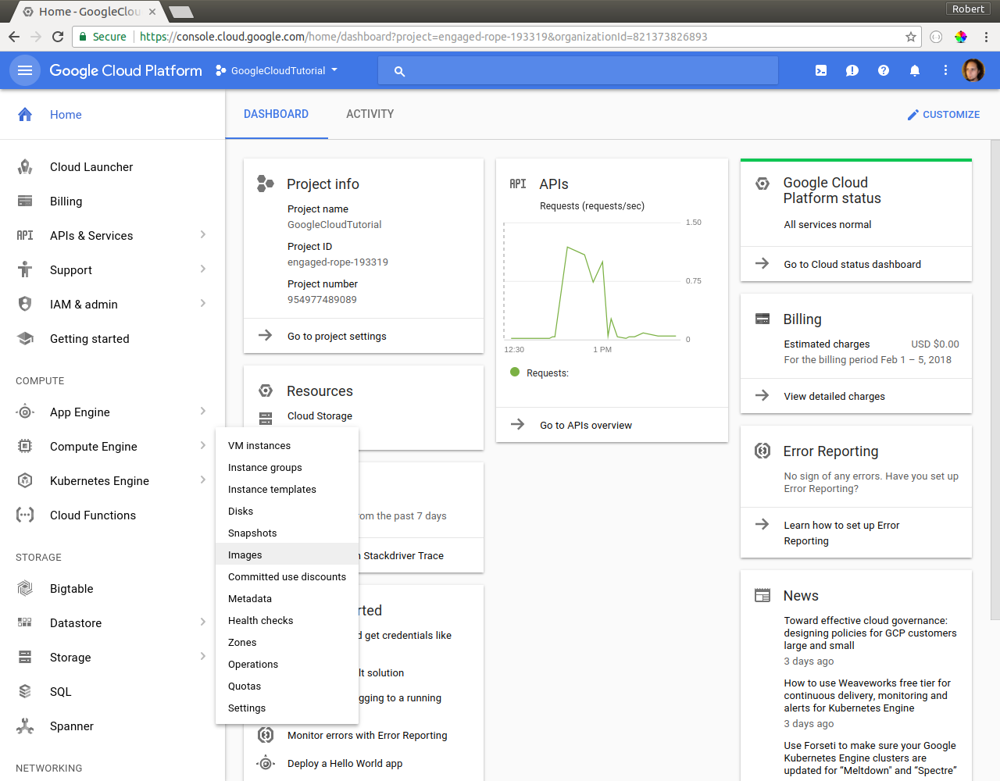
Next, click the **Create Image** button.
Give the image a suitable name, we have chosen *ubuntu-ml*.
For **Source** choose the *Cloud Storage file* option, and enter *ubuntu-ml/ubuntu-ml.tar.gz* as your filepath.
You should end up with a configuration that looks something like this:
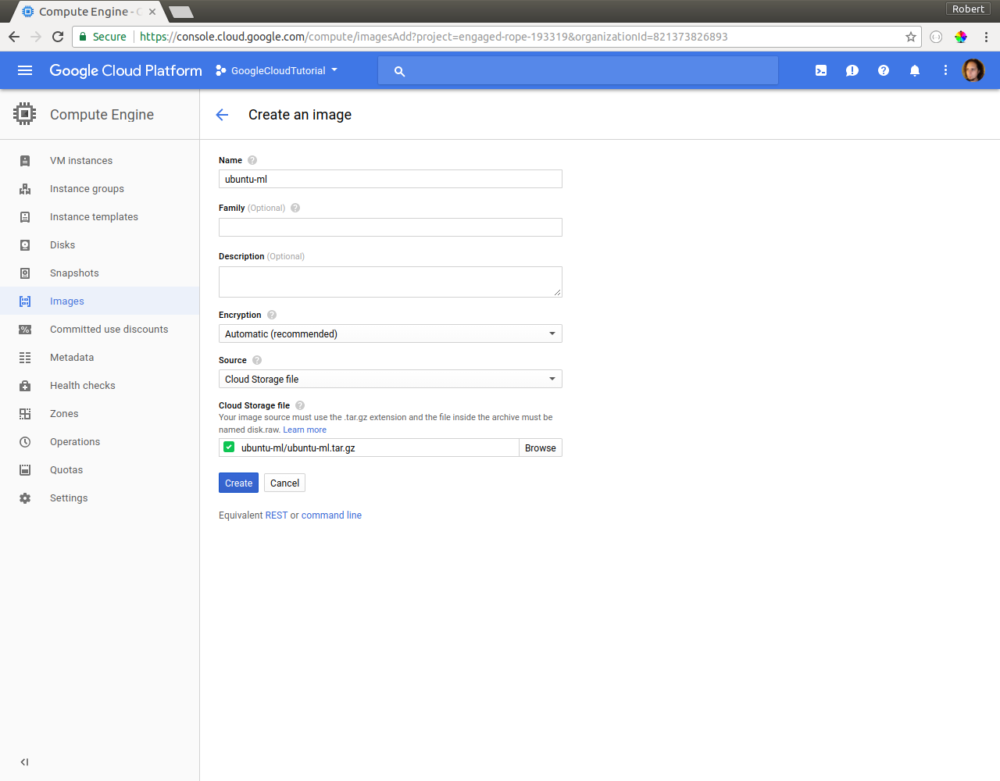
Press the blue **Create** button to create the image, this may take up to 30 minutes to complete.


Create a new VM Instance
---

Select **VM instances** on the left navbar (note: this is under **Compute Engine** if you are navigating from the home page of the Google Cloud console).
Next, click the blue **Create** button.
We now need to configure the instance.
The following configuration settings should be powerful enough to handle most models - feel free to adjust to your needs:

- **Zone**: us-west1-b
- **Cores**: 8
- **Memory**: 52 GB
- **Number of GPUs**: 1
- **GPU type**: NVIDIA Tesla K80

To use the image we created in the previous section, go to **Boot disk** and click **Change**, then click the **Custom images** tab and select the image you created:
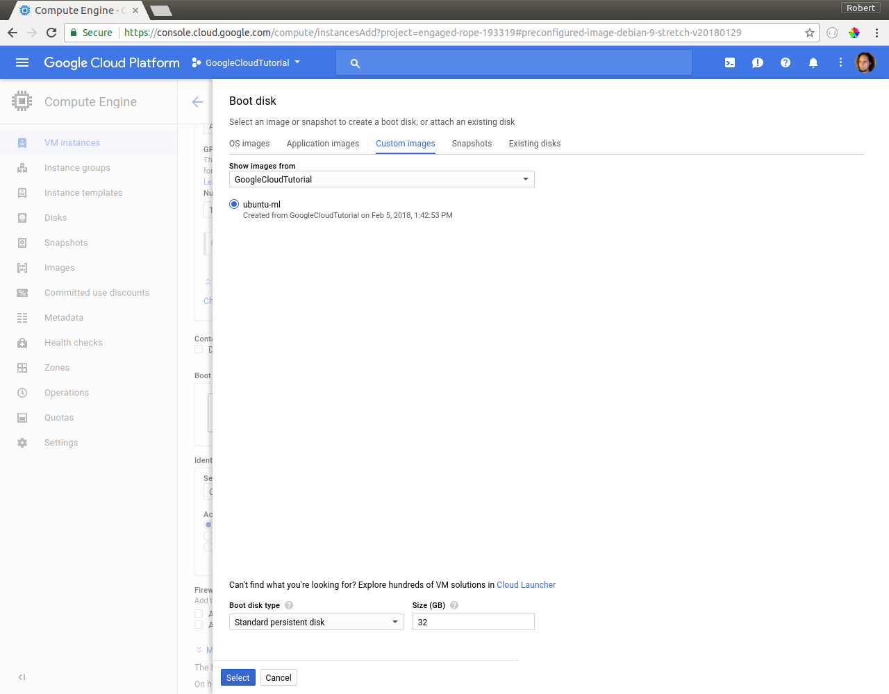
The default boot disk size is 32 GB.
If you want to store training/test data on the boot disk you should increase the amount of storage by the size of your dataset.
Alternatively you can create a seperate disk to hold data (which can be useful if you plan on using multiple VM instances).
For more details see [here](https://cloud.google.com/compute/docs/disks/).
Lastly, in the **Firewall** section you should check **allow HTTP traffic** and **allow HTTPS traffic** - this is needed if you plan on using Jupyter notebooks.

If you are following our recommendations your final configuration should look something like this:
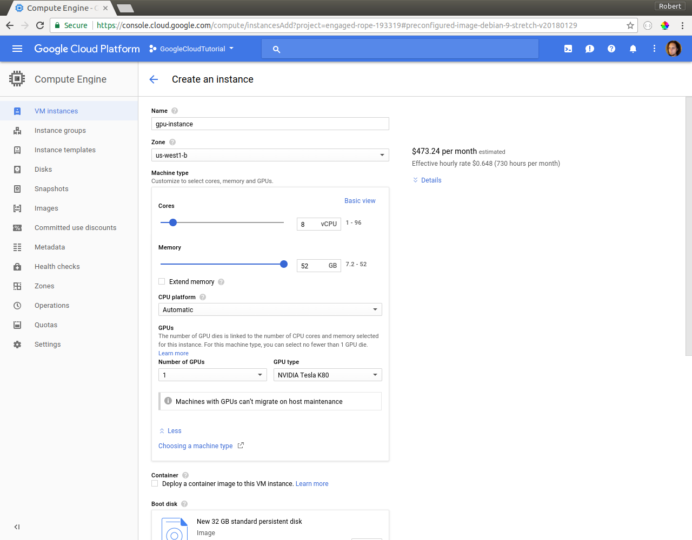
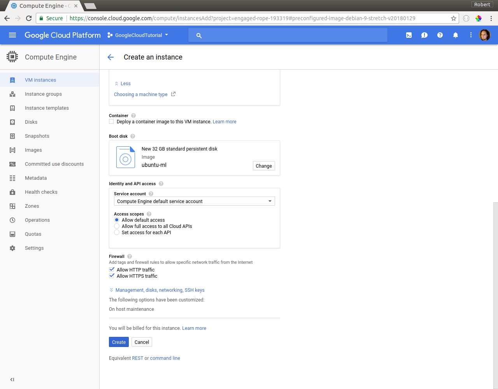
Once you have double-checked your settings, press **Create** to create the instance.


OBLIGATORY WARNING
===
**STOP YOUR VM INSTANCES WHEN YOU ARE NOT USING THEM OR YOU WILL RUN OUT OF CREDITS!!!**


Using the Virtual Machine Instance
===


Install the Google Cloud SDK
---
To use the virtual machine instance you will need to install the Google Cloud SDK.
Installation instructions are provided [here](https://cloud.google.com/sdk/docs/).
Once you've installed the SDK open your shell and run:
```bash
gcloud init
```
You will be prompted to enter in your Google user account information.
Make sure to use your UCI account, since this is what your credits are associated with.
Next, select your project id.
You can look it up in the Google Cloud Console if you've forgotten it.
Configure your Google Cloud compute settings to use *us-west1-b*.


Using the VM from the Command-line
---
To use the VM from the command line you can run
```bash
gcloud compute ssh [INSTANCE_NAME]
```
where `[INSTANCE_NAME]` is the name you chose for your VM instance (e.g. *gpu-instance* if you used the configuration above).
You will then be logged in to the virtual machine's command line, and can run commands just as your would on your own machine.
If you are unfamiliar with Linux you may find [this cheat sheet](https://www.linuxtrainingacademy.com/linux-commands-cheat-sheet/) helpful.


Transferring Data
---
To transfer data *from your local machine to your VM* you can run:
```bash
gcloud compute scp [LOCAL_FILE_PATH] [INSTANCE_NAME]:~/
```
on your local machine, where `[LOCAL_FILE_PATH]` is the path to the file you want to transfer and `[INSTANCE_NAME]` is the name of your VM.

To transfer data *from your VM to your local machine* you can reverse the arguments:
```bash
gcloud compute scp [INSTANCE_NAME]:[REMOTE_FILE_PATH] [LOCAL_FILE_PATH]
```
where `[REMOTE_FILE_PATH]` is the location of the file you wish to transfer in your VM.
For more details/examples, please refer to [the documentation](https://cloud.google.com/compute/docs/instances/transfer-files).

To download a file from the internet, you can use the following command while logged into your VM:
`wget [URL]`
where `[URL]` is the URL of the file you wish to download.


Using Jupyter
---
The following section is taken from Stanford CS231n's [Google Cloud tutorial](https://github.com/cs231n/cs231n.github.io/blob/master/google_cloud_tutorial.md) (provided under the MIT License).

Change the Extenal IP address of your GCE instance to be static (see screenshot below).


To do this, click on the 3 line icon next to the **Google Cloud Platform** button on the top left corner of your screen, go to **Networking** and **External IP addresses** (see screenshot below).


To have a static IP address, change **Type** from **Ephemeral** to **Static**. Enter your preffered name for your static IP, mine is assignment-1 (see screenshot below). And click on Reserve. Remember to release the static IP address when you are done because according to [this page](https://jeffdelaney.me/blog/running-jupyter-notebook-google-cloud-platform/ "Title") Google charges a small fee for unused static IPs. **Type** should now be set to **Static**.


Take note of your Static IP address (circled on the screenshot below). I used 104.196.224.11 for this tutorial.


One last thing you have to do is adding a new firewall rule allowing TCP acess to a particular \<PORT-NUMBER\>. I usually use 7000 or 8000 for \<PORT-NUMBER\>. Click on the 3 line icon at the top of the page next to **Google Cloud Platform**. On the menu that pops up on the left column, go to **Networking** and **Firewall rules** (see the screenshot below).


Click on the blue **CREATE FIREWALL RULE** button. Enter whatever name you want: I used assignment1-rules. Enter 0.0.0.0/0 for **Source IP ranges** and tcp:\<PORT-NUMBER\> for **Allowed protocols and ports** where \<PORT-NUMBER\> is the number you used above. Click on the blue **Create** button. See the screen shot below.


**NOTE:** Some people are seeing a different screen where instead of **Allowed protocols and ports** there is a field titled **Specified protocols and ports**. You should enter tcp:\<PORT-NUMBER\> for this field if this is the page you see. Also, if you see a field titled **Targets** select **All instances in the network**.

The following instructions are excerpts from [this page](https://haroldsoh.com/2016/04/28/set-up-anaconda-ipython-tensorflow-julia-on-a-google-compute-engine-vm/ "Title") that has more detailed instructions.

On your GCE instance check where the Jupyter configuration file is located:

```
ls ~/.jupyter/jupyter_notebook_config.py
```
Mine was in /home/timnitgebru/.jupyter/jupyter_notebook_config.py

If it doesn’t exist, create one:

```
# Remember to activate your virtualenv ('source .env/bin/activate') so you can actually run jupyter :)
jupyter notebook --generate-config
```

Using your favorite editor (vim, emacs etc...) add the following lines to the config file, (e.g.: /home/timnitgebru/.jupyter/jupyter_notebook_config.py):

```
c = get_config()

c.NotebookApp.ip = '*'

c.NotebookApp.open_browser = False

c.NotebookApp.port = <PORT-NUMBER>
```

Where \<PORT-NUMBER\> is the same number you used in the prior section. Save your changes and close the file.

The instructions below assume that you have SSH'd into your GCE instance using the prior instructions, have already downloaded and unzipped the current assignment folder into assignment**X** (where X is the assignment number), and have successfully configured Jupyter Notebook.


If you are not already in the assignment directory, cd into it by running the following command:

```
cd assignment1
```
If you haven't already done so, activate your virtualenv by running:

```
source .env/bin/activate
```

Launch Jupyter notebook using:

```
jupyter-notebook --no-browser --port=<PORT-NUMBER>
```

Where \<PORT-NUMBER\> is what you wrote in the prior section.

On your local browser, if you go to http://\<YOUR-EXTERNAL-IP-ADDRESS>:\<PORT-NUMBER\>, you should see something like the screen below. My value for \<YOUR-EXTERNAL-IP-ADDRESS\> was 104.196.224.11 as mentioned above. You should now be able to start working on your assignments.


